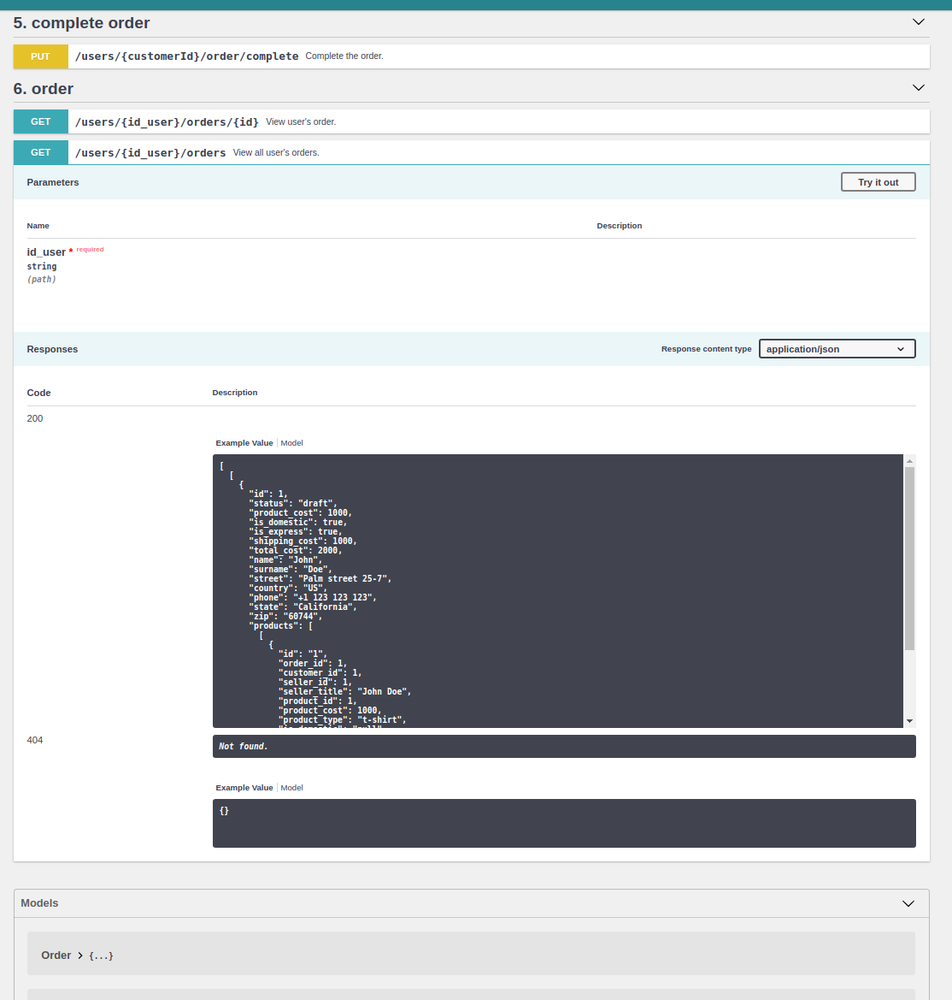

#### Let customers order Your custom shirts and mugs!

Create a product and set it's cost and title. After that customers from all the world can order them <sup>*</sup>.

## FIRST TIME? HOW TO SET THIS UP?

#### [Install docker]((https://github.com/janis-rullis/dev/blob/master/Docker/README.md#install))

Docker is a virtual environment with all the required software included. See [all other benefits](Why-use-docker.md).

#### Provide Your environment values

- Copy the `.env.example` to `.env` and fill `FILL_THIS` values in it.

#### Execute the `setup.sh` script <sup>*</sup>

It will download, install and prepare all the required software.

```shell
./setup.sh
```

#### Add these to Your `hosts` file

This transletes the machines address to the domain-name.

```
172.70.2.11     api.pr1.local
172.70.2.14     pma.pr1.local
```

## ALREADY SET-UP?

* `./start.sh` - Start containers once the setup has been done.
* `./connect.sh` - Connect to the main container.
* `./test.sh` - Execute PHPUnit tests.
* `./lint.sh` - Check and format the code.

## Documentation

This describes all the available functions and the way how to call them.

* http://api.pr1.local/doc



## Wiki

* https://github.com/janis-rullis/pr1/wiki

## Have questions? Found a bug?

Please, submit an issue [here](https://github.com/janis-rullis/pr1/issues).

## Honorable mentions

* Thanks to [@lauris-printify](https://github.com/lauris-printify) / [homework-v3](https://github.com/lauris-printify/homework-v3) for the main codebase (till [3d0a](https://github.com/janis-rullis/pr1/commit/3d0a2d1c0581493bfc67d3e201c3926741f608f6)) :+1: :1st_place_medal: :beers:
* [lara5-vue2-api](https://github.com/janis-rullis/lara5-vue2-api) for the Docker structure.


## Notes

- <sup>*</sup> currently from US-based companies.
- <sup>**</sup> `shell.sh` is just a helper that saves You from executing few commands Yourself. In case, if You can't execute it (*on Windows*) or there is some trouble, then You can set it up manually as every other Docker + Symfony project.